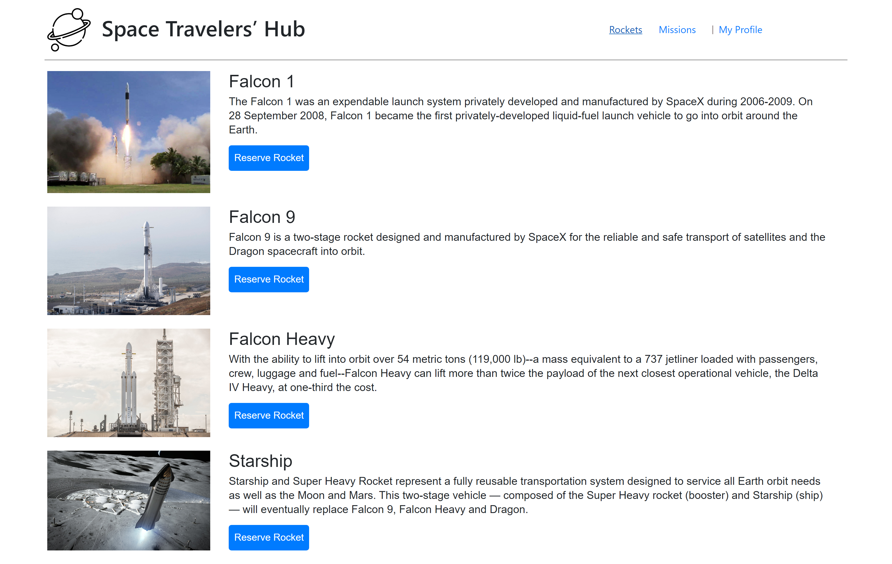
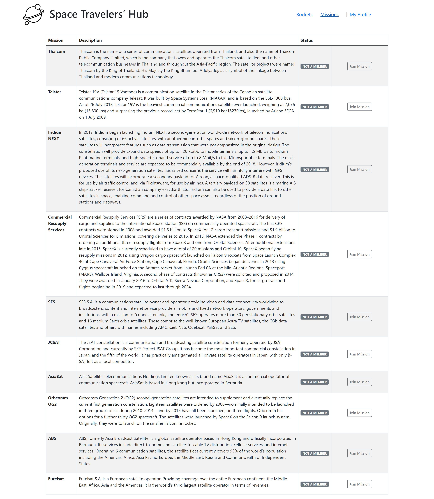

# Space Travelers' Hub

> This website is space company.

> |Rockets Page       |Missions Window|
> |--------------|--------------|
> ||| 

> You will find all kinds of rockets, you can reserve them, and you will find missions
which you can join

## Built With
  * ReactJS
  * Redux
  * react-bootstrap
  * react-icons

## Live Demo

[Live Demo](https://friendly-banach-a630ae.netlify.app/)

  #### Knowledge of these technologies
  * ReactJS
  * Redux
  * react-bootstrap
  * react-icons
### Setup
  * Open your command
  * Type "git clone https://github.com/ahmed-al-farouq/spaceX.git"
  * npm i
  * npm run start
### Install
  * Open command
  * npm i
### Deployment
  * npm run build

## Authors

:man::skin-tone-6: **Willy NTAZAMA**

- GitHub: [@ntzwilly](https://github.com/ntzwilly)
- LinkedIn: [@ntazamawilly](https://linkedin.com/in/ntazama-willy-b676b7aa)

:bearded_person: **Ahmed Al-Farouq**
  - Github: [@Ahmed-Alfarouq](https://github.com/ahmed-al-farouq)
  - LinkedIn: [LinkedIn](https://www.linkedin.com/in/ahmed-al-farouq/)
  - Twitter: [@twitter](https://twitter.com/ahmed_al_farouq)

## 🤝 Contributing

Contributions, issues, and feature requests are welcome!

Feel free to check the [issues page](../../issues/).

## Show your support

Give a ⭐️ if you like this project!

## Acknowledgments

- **``Microverse``** for the opportunity to underatake such project using their platform
- To family and friends who motivated us throughout this project
